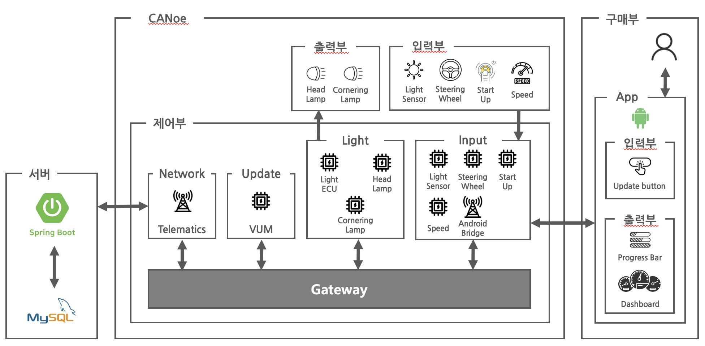
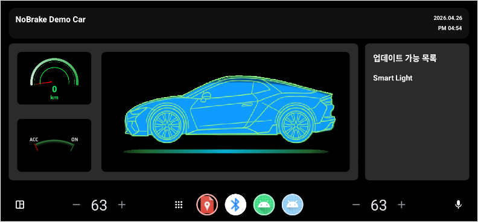

# 차량 기능 업데이트 제어 안드로이드 어플리케이션

## 프로젝트 개요

본 프로젝트는 기존에 진행했던 “OTA 기반 첨단 차량 기능 업데이트 시스템” 프로젝트를 기반으로 CANoe 자체 기능으로 단순하게 구현된 패널 부분을 실제 안드로이드 애플리케이션으로 개발해 보고자 추가로 진행한 프로젝트입니다.

[원본 프로젝트 링크](https://github.com/MOBIUS-BOOTCAMP-PBL-NoBrake/Nobrake_CANoeOTA)

## 추가된 부분
- TCP bridge를 통해 안드로이드 애플리케이션과 CANoe 간 양방향 통신 구축
- 대시보드에 차량 상태 및 업데이트 관련 창 표시
- 업데이트 버튼 클릭 이벤트 발생 시 CANoe로 업데이트 요청 메세지 전송
- ECU로부터 전달받은 진행률 값을 통한 진행 시각화

## 시스템 아키텍처

## 구현
### 대시보드 화면

### CANoe-대시보드 동작 시뮬레이션

